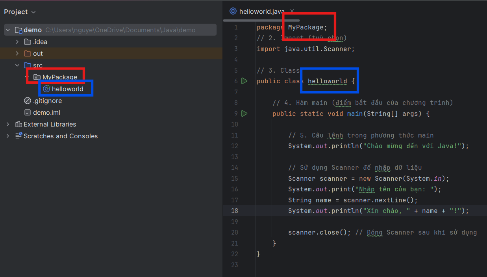

# Buổi 1: Welcome to JAVA
## Java là gì?

**Java** là ngôn ngữ lập trình bậc cao hướng đối tượng được phát triển bởi *Sun Microsystems* (nay thuộc **Oracle**) vào năm 1995 với cú pháp theo phong cách *C/C++*.

## Lí do ra đời của Java
**Java** ra đời với mong muốn giải quyết các vấn đề ngôn ngữ những năm 1990s như tính đa nền tảng (nhờ cơ chế `Java Virtual Machine - JVM`), bảo mật, và sự đơn giản hóa.

**Java** ban đầu được thiết kế cho việc lập trình các thiết bị truyền hình tương tác; các thiết bị như TV, Smart phone, Đồ gia dụng điện tử với cái tên **Oak**. Sau đó, dự án có tên là **Green** và cuối cùng được đổi tên thành **Java**.

## Cách Java hoạt động
    Java hoạt động nhờ cơ chế JVM
- Lập trình viên viết mã Java và lưu vào file `.java`
- Trình biên dịch Java (`javac`) biên dịch tệp `.java` thành tệp `.class` chứa mã bytecode.
- JVM tải và thực thi mã bytecode trong tệp `.class`. Tùy vào hệ điều hành, JVM sẽ chuyển mã bytecode thành mã máy phù hợp với hệ thống và thực thi nó.

_Ưu điểm:_
* _Tính đa nền tảng: nhờ JVM_
* _Bảo mật cao: Mã bytecode chạy trong JVM được kiểm tra và bảo vệ khỏi những hành vi bất thường._
* _Hiệu năng:các cơ chế như JIT giúp tối ưu hiệu suất của ứng dụng Java._

_Nhược điểm:_
* _Hiệu suất ban đầu: Do JVM phải biên dịch mã bytecode thành mã máy khi chạy, có thể có một số chậm trễ ban đầu so với các ngôn ngữ như C++._
* _Tài nguyên bộ nhớ: JVM yêu cầu bộ nhớ và CPU đáng kể để chạy_

## Cấu trúc một chương trình Java
```java
// 1. Package (tuỳ chọn)
package JavaDemo;

// 2. Import (tuỳ chọn)
import java.util.Scanner;

// 3. Class
public class HelloWorld {

    // 4. Hàm main (điểm bắt đầu của chương trình)
    public static void main(String[] args) {

        // 5. Câu lệnh trong main
        Scanner sc = new Scanner(System.in);
        System.out.print("You're name's: ");
        String name = sc.nextLine();
        System.out.println("Have a great day " + name + "!");
        
        scanner.close();
    }
}

```
_Trong đó: package (gói) là cách để tổ chức các lớp (classes) liên quan thành nhóm, giúp quản lý mã nguồn tốt hơn, tránh xung đột tên lớp và dễ dàng tái sử dụng các lớp._


## Syntax cơ bản 
```java
// Khai báo biến
int age = 25;               // Kiểu int
double salary = 50000.0;   // Kiểu double
char grade = 'A';          // Kiểu char
boolean isEmployed = true; // Kiểu boolean
String name = "John";      // Kiểu String

//Câu lệnh điều kiện
if (age >= 18) {
    System.out.println("Bạn là người lớn tuổi.");
} else {
    System.out.println("Bạn còn nhỏ tuổi.");
}

//Vòng lặp for
for (int i = 0; i < 5; i++) {
    System.out.println("Giá trị i là: " + i);
}

//Vòng lặp while
int count = 0;
while (count < 5) {
    System.out.println("Giá trị count là: " + count);
    count++;
}

// Khai báo và khởi tạo mảng
int[] numbers = {1, 2, 3, 4, 5};

// Truy cập vào phần tử của mảng
System.out.println("Số đầu tiên trong mảng là: " + numbers[0]);

// Khai báo hàm
public static void greet(String name) {
    System.out.println("Chào " + name + "!");
}

// Gọi hàm
greet("An");
```

## Tổng quan về Class và Object
**1. Class (Lớp)**

**Class** là một bản thiết kế (blueprint) cho các đối tượng. Nó định nghĩa các thuộc tính (properties) và phương thức (methods) mà các đối tượng của lớp đó sẽ có. Class giúp nhóm các thuộc tính và phương thức lại với nhau theo một cách có tổ chức.
```java
public class sinhvien {
    // Thuộc tính
    String name;
    int age;

    // Constructor
    public traiPIT(String name, int age) {
        this.name = name;
        this.age = age;
    }

    // Phương thức
    public void code() {
        System.out.println(name + " đang code");
    }
    public void showInfo() {
        System.out.println("Tên: " + name + ", Tuổi: " + age);
    }
}

```

**2. Object**

**Object** là một thực thể cụ thể được tạo ra từ một class. Mỗi đối tượng có trạng thái và hành vi riêng biệt, dựa trên class mà nó được tạo ra.
```java
public class Main {
    public static void main(String[] args) {
        // Tạo đối tượng traiPRO từ lớp traiPTIT
        traiPTIT traiPRO = new traiPTIT("An", 19);
        
        // Gọi phương thức
        traiPRO.code();
        traiPRO.showInfo();
    }
}
```
## Một số từ khóa
**1. This**
    
**This** thường được sử dụng khi tên của biến thành viên trùng với tên của tham số.
```java
public class Dog {
    String name;
    int age;
    // Constructor
    public Dog(String name, int age) {
        this.name = name; // `this.name` là thuộc tính của lớp, `name` là tham số
        this.age = age;   // `this.age` là thuộc tính của lớp, `age` là tham số
    }
}

```
**2. Constructor (Hàm khởi tạo)**

**Contructor** là một phương thức đặc biệt được gọi khi tạo một đối tượng. Sử dụng để khởi tạo các thuộc tính của đối tượng khi nó được tạo ra.

**3. Access Modifier (Bộ truy cập)**

**AM** được sử dụng để kiểm soát khả năng truy cập vào các thuộc tính và phương thức của lớp. Có bốn loại access modifiers chính trong Java:
* **public:** Có thể được truy cập từ bất kỳ đâu.
* **private:** Chỉ có thể được truy cập từ trong cùng một lớp.
* **protected:** Có thể được truy cập từ cùng một lớp, các lớp con và các lớp trong cùng package.
* **default (không chỉ định gì):** Có thể được truy cập từ các lớp trong cùng package.
```java
public class Dog {
    private String name; // Chỉ có thể truy cập từ trong lớp Dog
    public int age;      // Có thể truy cập từ bất kỳ đâu

    public Dog(String name, int age) {
        this.name = name;
        this.age = age;
    }
}
```
**4. Getter và Setter**

**Getter** và **Setter** là các phương thức được sử dụng để truy cập và thay đổi giá trị của các thuộc tính riêng tư (private) trong lớp.
* **Getter:** Phương thức trả về giá trị của thuộc tính.
* **Setter:** Phương thức để thay đổi giá trị của thuộc tính.
```java
public class Dog {
    private String name;
    private int age;

    // Getter cho tên
    public String getName() {
        return name;
    }

    // Setter cho tên
    public void setName(String name) {
        this.name = name;
    }

    // Getter cho tuổi
    public int getAge() {
        return age;
    }

    // Setter cho tuổi
    public void setAge(int age) {
        this.age = age;
    }
}
```
**5. Từ khóa `static`**

**`static`** là một từ khóa được sử dụng để chỉ định rằng một thuộc tính hoặc phương thức thuộc về lớp, chứ không phải thuộc về các đối tượng cụ thể của lớp đó.

Các thuộc tính hoặc phương thức static có thể được truy cập mà không cần tạo đối tượng của lớp.

```java
public class Dog {
    static int count = 0; // Thuộc tính static

    public Dog() {
        count++; // Tăng biến đếm mỗi khi tạo một đối tượng Dog
    }

    public static void showCount() { // Phương thức static
        System.out.println("Số lượng chó: " + count);
    }
}

// Sử dụng phương thức static
Dog dog1 = new Dog();
Dog dog2 = new Dog();
Dog.showCount(); // In ra: Số lượng chó: 2
```