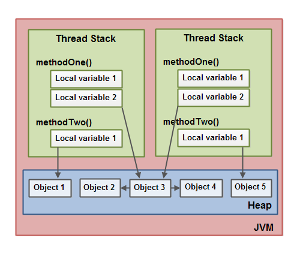

# Buổi 2: Tìm hiểu sâu về Object
## 1. Object là gì?
**Object** là một đối tượng cụ thể của một **Class** trong ***Java***. Ta có thể hiểu Class là bản thiết kế chung cho một nhóm đối tượng và Object là một đối tượng cụ thể được tạo ra bằng bản thiết kế đó.

```java
public class Student {
    //class Student
    public String name, address;
}
public class Main {
    //tạo một object a
    Student a = new Student();
}
```

    Object chứa các *dữ liệu* và *các phương thức* đã được định nghĩa trong class, giúp thực hiện các thao tác trên dữ liệu đó.
## 2. Object được lưu thế nào trong Java?
#### 2.1 Lưu trữ Object
Trong Java, khi một Object được tạo bởi từ khóa `new` thì nó sẽ được lưu trữ trong **Heap Memory**. Bên cạnh đó, Java sử dụng **Stack Memory** để quản lý các tham chiếu và các biến local.



    Ví dụ:
```java
    public class Main {
    public static void main(String[] args) {
        Person person = new Person("An"); // Tạo một object trong Heap
    }
}
```
#### 2.2 Heap Memory và Stack Memory
Heap Memory:
- Heap Memory là vùng nhớ nơi tất cả các object được tạo bằng từ khóa new được lưu trữ.
- Khi bạn tạo một object, ví dụ: `Student student = new Student();`, object `student` sẽ được lưu trữ trong Heap Memory, còn biến `student` chỉ là một tham chiếu đến object đó.
- Heap Memory được quản lý bởi Garbage Collector của Java, có nhiệm vụ tự động giải phóng bộ nhớ.
- Công dụng: Duy trì dữ liệu tồn tại lâu dài qua nhiều lời gọi hàm.

Stack Memory
- Stack Memory thường nhỏ hơn Heap Memory và có tính chất ngăn xếp **(LIFO)**
- Lưu trữ các biến local của các phương thức và các tham chiếu đến object 
- Quản lý tự động: Java tự động giải phóng Stack Memory khi một hàm kết thúc

| **Đặc điểm**           | **Heap Memory**                          | **Stack Memory**                    |
| ---------------------- | ---------------------------------------- | ----------------------------------- |
| **Mục đích**           | Lưu trữ các object                       | Lưu trữ biến local và tham chiếu    |
| **Kích thước**         | Lớn hơn                                  | Nhỏ hơn, riêng biệt cho từng thread |
| **Quản lý**            | Bởi Garbage Collector                    | Tự động khi kết thúc hàm            |
| **Truy cập**           | Toàn cục, truy cập từ bất kỳ thread nào  | Cục bộ cho từng thread              |
| **Tốc độ**             | Chậm hơn Stack do phải quản lý linh động | Nhanh hơn do quản lý ngăn nắp       |
| **Vấn đề tràn bộ nhớ** | Dễ xảy ra nếu tạo quá nhiều object       | Dễ xảy ra nếu gọi đệ quy quá sâu    |

## 3. Wrapper class
#### 3.1 Wrapper là gì?
- Wrapper class là các class được tạo ra để bao bọc các kiểu dữ liệu nguyên thuỷ. Ví dụ: Integer, Float, Double, Boolean, Character,…

| Kiểu dữ liệu nguyên thủy | Lớp Wrapper |
| ------------------------ | ----------- |
| `int`                    | `Integer`   |
| `boolean`                | `Boolean`   |
| `char`                   | `Character` |
| `byte`                   | `Byte`      |
| `short`                  | `Short`     |
| `long`                   | `Long`      |
| `float`                  | `Float`     |
| `double`                 | `Double`    |
#### 3.2 Công dụng Wrapper
*Một số thư viện và API trong Java yêu cầu dữ liệu dưới dạng đối tượng thay vì kiểu nguyên thủy. Ví dụ, các lớp như `ArrayList`, `HashMap` hoặc `HashSet` không thể lưu trữ trực tiếp các kiểu nguyên thủy (`int`, `double`, ...), mà chỉ nhận đối tượng. Wrapper class cho phép chuyển đổi kiểu nguyên thủy thành đối tượng để sử dụng trong các cấu trúc này.*

Một số công dụng của Wrapper:
-   Chuyển đổi và định dạng dữ liệu VD:
```java
public class ParseExample {
    public static void main(String[] args) {
        String numberString = "123";

        // Chuyển từ String sang int
        int number = Integer.parseInt(numberString);

        System.out.println("Giá trị int: " + number);  // Output: Giá trị int: 123
    }
}
```

- Tận dụng tính năng của lập trình hướng đối tượng. VD: wrapper có các phương thức như `compareTo()` để so sánh đối tượng, điều mà các kiểu nguyên thủy không hỗ trợ.

```java
public class CompareExample {
    public static void main(String[] args) {
        Integer num1 = 10;
        Integer num2 = 20;

        // So sánh hai số nguyên bằng compareTo
        if (num1.compareTo(num2) < 0) {
            System.out.println(num1 + " nhỏ hơn " + num2);
        } else {
            System.out.println(num1 + " lớn hơn hoặc bằng " + num2);
        }
    }
}

```
-   Hỗ trợ tự động boxing/unboxing
```java
import java.util.ArrayList;

public class WrapperExample {
    public static void main(String[] args) {
        ArrayList<Integer> list = new ArrayList<>();

        // Boxing - chuyển từ int sang Integer
        list.add(10);  // Java tự động chuyển 10 thành Integer.valueOf(10)

        // Unboxing - chuyển từ Integer về int
        int num = list.get(0);  // Java tự động gọi list.get(0).intValue()

        System.out.println("Giá trị trong danh sách: " + num);  // Output: Giá trị trong danh sách: 10
    }
}
```
## 4. Auto-boxing và Auto-unboxing
- Auto-boxing là quá trình chuyển đổi từ kiểu dữ liệu nguyên thuỷ sang kiểu dữ liệu lưu dạng object.
```java
public class AutoBoxingExample {
    public static void main(String[] args) {
        int primitiveInt = 5;

        // Auto boxing - tự động chuyển đổi int thành Integer
        Integer wrappedInt = primitiveInt; // Java tự động chuyển đổi

        System.out.println("Giá trị bọc: " + wrappedInt); // Output: Giá trị bọc: 5
    }
}
```
- Auto-unboxing là quá trình chuyển đổi từ kiểu dữ liệu lưu dạng object sang kiểu dữ liệu nguyên thuỷ.
```java
public class AutoUnboxingExample {
    public static void main(String[] args) {
        Integer wrappedInt = 10; // Auto boxing (tự động chuyển đổi)

        // Auto unboxing - tự động chuyển đổi Integer thành int
        int primitiveInt = wrappedInt; // Java tự động chuyển đổi

        System.out.println("Giá trị nguyên thủy: " + primitiveInt); // Output: Giá trị nguyên thủy: 10
    }
}
```

##### Một số lưu ý khi sử dụng:
- **Hiệu suất:** Auto boxing tạo ra một đối tượng mới mỗi khi bạn chuyển đổi kiểu nguyên thủy sang đối tượng -> tiêu tốn tài nguyên.
- **NullPointerException:** Khi auto unbox một đối tượng wrapper mà có giá trị `null`, Java sẽ ném ra một `NullPointerException`. Cần đảm bảo rằng đối tượng wrapper không phải là `null` trước khi thực hiện auto unboxing.
```java
Integer wrappedInt = null;
int primitiveInt = wrappedInt; // Sẽ gây ra NullPointerException
```
- **So sánh bằng `==`:** Khi sử dụng `==` thì nó so sánh địa chỉ bộ nhớ thay vì giá trị. Để so sánh giá trị, bạn nên sử dụng phương thức `.equals()`.
```java
Integer a = 1000;
Integer b = 1000;

// Sẽ trả về false do a và b là hai đối tượng khác nhau
System.out.println(a == b); // Output: false
// Sẽ trả về true vì giá trị của a và b giống nhau
System.out.println(a.equals(b)); // Output: true
```
## 5. String và StringBuilder
Trong Java, String và StringBuilder đều được sử dụng để làm việc với chuỗi văn bản, nhưng chúng có những đặc điểm và công dụng khác nhau. Dưới đây là so sánh giữa chúng:
#### 5.1 String
```java
String str = "Hello";
str += " World"; // Tạo một đối tượng String mới
```
- Tính **Immutable:** Một khi một đối tượng `String` được tạo ra, nó không thể thay đổi. Nếu bạn thực hiện các thao tác như nối hoặc thay thế, Java sẽ tạo một đối tượng `String` mới, trong khi đối tượng cũ vẫn giữ nguyên. Điều này có thể dẫn đến việc tiêu tốn bộ nhớ và hiệu suất nếu thực hiện nhiều thao tác trên chuỗi.
#### 5.2 StringBuilder
```java
StringBuilder sb = new StringBuilder("Hello");
sb.append(" World"); // Thay đổi nội dung mà không tạo đối tượng mới
```
- Tính **Mutable:** Đối tượng `StringBuilder` có thể thay đổi. Bạn có thể thay đổi nội dung của `StringBuilder` mà không cần tạo một đối tượng mới. Điều này giúp tiết kiệm bộ nhớ và cải thiện hiệu suất khi thực hiện nhiều thao tác nối chuỗi.
- `StringBuilder` được tối ưu cho các thao tác nối chuỗi nhiều lần, như trong vòng lặp
## 6. Cách Java truyền tham số | Pass-by-value
#### 6.1 Pass-by-value
- **Với tham số:** Khi ta truyền tham số vào 1 hàm thì ra đang truyền giá trị của nó, tại đó tham số được copy sang vùng nhớ khác và hàm sẽ thao tác với vùng nhớ mới này *(tương tự truyền tham số trong C)*
- **Với đối tượng (Object):** Java sẽ sao chép tham chiếu đến đối tượng đó. Tuy nhiên, tham chiếu này cũng là một bản sao, vì vậy nếu bạn thay đổi tham số trong phương thức, tham chiếu vẫn giữ nguyên và đối tượng gốc không bị thay đổi. Nhưng nếu bạn thay đổi nội dung của đối tượng thông qua tham chiếu đó, thay đổi sẽ có tác dụng lên đối tượng gốc.
## 7. Garbage Collector(GC)
- Trong quá trình thực thi chương trình, Java sẽ liên tục tìm các Object không được tham chiếu tới **Heap Memory** (mang giá trị `null` hoặc một vài trường hợp khác). Sau đó **Garbage Collector** sẽ tự động giải phóng bộ nhớ cho các ô nhớ chứa tham chiếu đó.
- Điều này khiến lập trình viên không cần phải giải phóng bộ nhớ thủ công như C/C++. Thay vào đó, để giải phóng bộ nhớ, ta chỉ cần loại bỏ tham chiếu của **Object**.