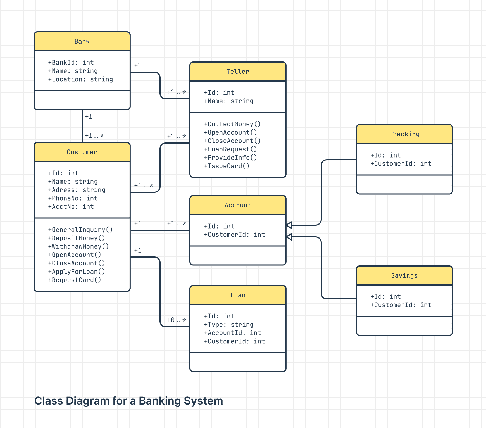
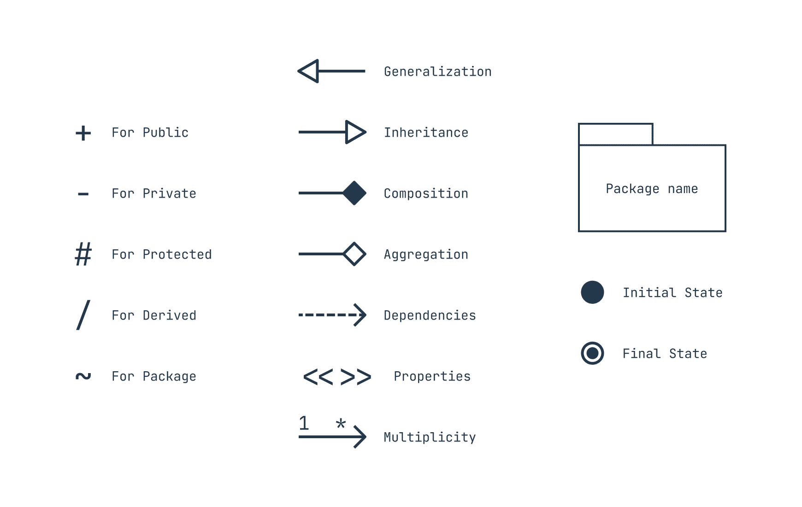

# BUỔI 4: LẬP TRÌNH KHÔNG CHỈ LÀ CODE
## 1. Version Control
#### 1.1. Khái niệm
**Version Control** (hệ thống kiểm soát phiên bản) là một phương pháp quản lý, lưu trữ và theo dõi các thay đổi của mã nguồn hoặc tài liệu trong quá trình phát triển phần mềm. Mỗi khi có thay đổi trong mã nguồn, hệ thống này lưu lại một phiên bản mới, giúp người dùng có thể xem lại hoặc quay lại các phiên bản trước nếu cần.
#### 1.2. Chức năng
- **Lưu trữ lịch sử thay đổi:** Giúp lưu lại mọi thay đổi của mã nguồn, bao gồm thời gian, nội dung thay đổi và người thực hiện thay đổi.
- **Phục hồi phiên bản:** Người dùng có thể quay lại các phiên bản trước nếu phát hiện lỗi ở phiên bản hiện tại.
- **Làm việc nhóm:** Hỗ trợ nhiều người làm việc trên cùng một dự án bằng cách quản lý các phiên bản khác nhau, giảm thiểu xung đột khi nhiều người thay đổi mã nguồn cùng lúc.
#### 1.3. Git là gì và vai trò của nó trong Version Control
Git là một hệ thống kiểm soát phiên bản phân tán (distributed version control system). Đây là công cụ phổ biến giúp các lập trình viên quản lý mã nguồn hiệu quả và làm việc nhóm tốt hơn. Git cho phép:
- Lưu trữ cục bộ: Mỗi người dùng đều có một bản sao hoàn chỉnh của dự án trên máy tính của mình, giúp làm việc offline dễ dàng.
- Phân nhánh và gộp nhánh: Git cho phép tạo các nhánh độc lập (branch) để thử nghiệm các tính năng mới mà không ảnh hưởng đến mã nguồn chính. Khi tính năng mới hoàn tất, có thể gộp nhánh vào nhánh chính.

Git không chỉ giúp quản lý mã nguồn mà còn được tích hợp trên nhiều nền tảng như GitHub, GitLab, và Bitbucket, giúp các lập trình viên lưu trữ và chia sẻ mã nguồn trực tuyến, dễ dàng làm việc nhóm và quản lý dự án.
## 2. Các khái niệm về Git
#### 1.1. Repository (Kho lưu trữ)
- Là nơi chứa toàn bộ mã nguồn của dự án, cùng với lịch sử thay đổi, các nhánh và commit. Có thể coi repository như thư mục chính của dự án, bao gồm tất cả file và cấu trúc cần thiết.
- Repository có thể là cục bộ trên máy tính cá nhân hoặc từ xa trên các nền tảng như GitHub, GitLab.
#### 1.2. Branch (Nhánh)
- Là một "nhánh" riêng biệt của mã nguồn, cho phép phát triển hoặc thử nghiệm một tính năng mới mà không ảnh hưởng đến mã nguồn chính (thường là nhánh main hoặc master).
- Các thay đổi trong nhánh này có thể được gộp lại với nhánh chính thông qua quá trình Merge hoặc Rebase.
#### 1.3. Commit
- Là một điểm lưu trữ các thay đổi trong mã nguồn, giúp bạn lưu lại lịch sử của dự án theo từng bước. Mỗi commit lưu thông tin về những thay đổi, người thực hiện và thời gian thực hiện.
- Một commit bao gồm một thông điệp (message) mô tả ngắn gọn các thay đổi.
#### 1.4. Merge
- Là quá trình kết hợp các thay đổi từ một nhánh khác vào nhánh hiện tại. Merge cho phép cập nhật nhánh chính với các thay đổi từ nhánh khác mà không cần phải chỉnh sửa lại mã nguồn thủ công.
- Khi có xung đột (conflict) trong mã nguồn, bạn sẽ cần phải giải quyết xung đột trước khi hoàn thành merge.
#### 1.5. Rebase
- Là một cách khác để hợp nhất các thay đổi từ một nhánh vào nhánh khác. Rebase sẽ đặt các commit của nhánh hiện tại lên trên các commit của nhánh chính, làm lịch sử commit trở nên "sạch" và dễ hiểu hơn.
Lưu ý: Rebase có thể làm mất lịch sử commit cũ, nên cần thận trọng khi sử dụng.
#### 1.6. Gộp Commit
- Gộp commit (squash commits) là quá trình kết hợp nhiều commit thành một commit duy nhất để làm cho lịch sử commit gọn gàng hơn.
- Đây là cách hữu ích khi bạn muốn giữ lịch sử sạch, giảm số lượng commit khi các commit nhỏ lẻ không cần thiết.
#### 1.7. Pull
- Là thao tác cập nhật mã nguồn từ repository từ xa về repository cục bộ, đồng thời thực hiện fetch và merge.
- Lệnh git pull giúp bạn đồng bộ với các thay đổi mới nhất từ repository từ xa.
#### 1.8. Push
- Là thao tác gửi các commit từ repository cục bộ lên repository từ xa, giúp người khác có thể nhìn thấy và làm việc với những thay đổi bạn đã thực hiện.
- Lệnh git push cần thiết để cập nhật mã nguồn từ cục bộ lên GitHub hoặc GitLab.
#### 1.9. Clone
- Là quá trình sao chép một repository từ xa về máy tính cá nhân, bao gồm toàn bộ mã nguồn và lịch sử commit của dự án.
Lệnh git clone thường được dùng khi bắt đầu làm việc với một dự án mới.
#### 1.10. Fork
- Là hành động tạo một bản sao độc lập của repository từ xa lên tài khoản của bạn trên nền tảng GitHub hoặc GitLab.
Fork thường được dùng để đóng góp cho dự án mã nguồn mở, giúp tạo một bản sao mà bạn có thể tùy ý chỉnh sửa trước khi gửi yêu cầu (Pull Request) về repository gốc.
#### 1.11. Pull Request (PR)
- Là yêu cầu gộp mã (merge) từ một nhánh của bạn vào nhánh chính của repository gốc, thường được dùng khi bạn muốn đóng góp vào dự án của người khác.
- Pull Request giúp người quản lý dự án xem xét và thảo luận về các thay đổi trước khi tích hợp vào dự án chính.
#### 1.12. Gitignore
- Là file .gitignore chứa danh sách các file và thư mục mà bạn muốn Git bỏ qua, không theo dõi hoặc commit lên repository.
- Những file thường được liệt kê trong .gitignore bao gồm file cấu hình cá nhân, file tạm,...
## 3. Pull Request
#### 3.1. Khi nào cần tạo Pull Request?
Pull Request (PR) được sử dụng khi bạn muốn đóng góp mã nguồn của mình vào một repository mà bạn không phải là chủ sở hữu hoặc muốn hợp tác với người khác. Cụ thể, bạn sẽ cần tạo Pull Request khi:
- **Đóng góp vào dự án mã nguồn mở:** Nếu bạn muốn cải tiến hoặc sửa lỗi cho một dự án mã nguồn mở trên GitHub, bạn có thể fork repository đó, thực hiện các thay đổi trong repository cá nhân, sau đó tạo Pull Request để đề xuất gộp các thay đổi của bạn vào dự án chính.
- **Làm việc nhóm:** Khi làm việc nhóm, các thành viên có thể làm việc trên nhánh riêng để phát triển tính năng hoặc sửa lỗi. Khi hoàn thành, họ tạo Pull Request để yêu cầu gộp các thay đổi vào nhánh chính. Điều này cho phép các thành viên khác kiểm tra và xem xét các thay đổi trước khi hợp nhất.
- **Xem xét mã nguồn:** Pull Request giúp bạn dễ dàng chia sẻ thay đổi của mình với các thành viên khác, nhận phản hồi, và đảm bảo chất lượng mã nguồn thông qua quá trình kiểm tra trước khi đưa vào mã nguồn chính.
#### 3.2. Cách tạo Pull Request
###### B1. Fork Repository và Tạo Nhánh Mới

- Trước tiên, truy cập vào repository mà bạn muốn đóng góp. Nhấn nút Fork ở góc trên bên phải để sao chép repository về tài khoản GitHub của bạn.
- Trong repository vừa fork, tạo một nhánh mới để chứa các thay đổi của bạn. Bạn có thể tạo nhánh này bằng cách chạy lệnh `git checkout -b <branch-name>` trong Git hoặc dùng giao diện GitHub Desktop.
###### B2. Thực hiện Thay đổi và Commit

- Thực hiện các thay đổi mà bạn muốn đóng góp vào repository.
- Sau khi chỉnh sửa, commit các thay đổi của bạn. Bạn có thể thực hiện qua giao diện hoặc dùng lệnh `git commit -m "Mô tả thay đổi"`.
###### B3. Push Nhánh Lên GitHub

Khi đã hoàn thành thay đổi, push nhánh của bạn lên repository từ xa của bạn trên GitHub bằng lệnh `git push origin <branch-name>`.
###### B4. Tạo Pull Request

- Truy cập vào repository của bạn trên GitHub. Bạn sẽ thấy thông báo xuất hiện với nội dung như **"Compare & pull request"** ngay sau khi bạn push nhánh mới.
Nhấn vào **Compare & pull request** để tạo Pull Request.
###### B5. Điền Thông Tin Cho Pull Request

- Thêm tiêu đề và mô tả ngắn gọn cho Pull Request, giải thích các thay đổi mà bạn đã thực hiện.
- Kiểm tra nhánh nguồn (source branch) là nhánh bạn vừa tạo và nhánh đích (target branch) là nhánh chính hoặc nhánh bạn muốn gộp vào.
- Nhấn nút **Create Pull Request** để gửi yêu cầu.
###### B6. Phản hồi và xem xét

Đội ngũ hoặc người quản lý dự án sẽ xem xét Pull Request của bạn. Nếu cần sửa đổi, họ có thể để lại nhận xét để bạn chỉnh sửa.
Khi mọi thứ ổn, họ sẽ hợp nhất (merge) Pull Request của bạn vào repository chính.
## 4. Resolve conflict khi merge pull request
Khi bạn thực hiện `merge` một Pull Request và Git phát hiện có xung đột (conflict) giữa các thay đổi trong nhánh của bạn và nhánh đích (nhánh chính), bạn cần phải giải quyết xung đột trước khi hoàn tất việc merge.
###### B1. Nhận Thông Báo Xung Đột
- Khi bạn tạo Pull Request hoặc cố gắng merge vào nhánh chính (ví dụ, main), GitHub sẽ thông báo rằng có xung đột giữa các nhánh và bạn cần phải giải quyết xung đột đó.
- Xung đột có thể xảy ra khi cả hai nhánh đều thay đổi cùng một phần của file hoặc nếu có sự khác biệt trong cấu trúc mã nguồn.
###### B2. Kiểm Tra Xung Đột trên GitHub
- Trên GitHub, trong Pull Request, sẽ có một thông báo về xung đột. Bạn sẽ thấy nút Resolve conflicts (Giải quyết xung đột).
- Nhấn vào nút đó để GitHub hiển thị các file có xung đột, cùng với các đoạn mã xung đột cần được giải quyết.
###### B3. Giải Quyết Xung Đột Trên GitHub (Giao diện Web)
Trên GitHub, bạn có thể chỉnh sửa trực tiếp các file có xung đột bằng giao diện web.
```java
<<<<<<< HEAD
public class Example {
    public static void main(String[] args) {
        System.out.println("Hello from the base branch!");
    }
}
=======
public class Example {
    public static void main(String[] args) {
        System.out.println("Hello from the feature branch!");
    }
}
>>>>>>> feature-branch
```
Bạn cần phải quyết định giữ thay đổi của nhánh nào hoặc kết hợp chúng lại sao cho hợp lý. Sau khi sửa xong, bạn có thể nhấn Mark as resolved và commit lại các thay đổi.
###### B4. Giải Quyết Xung Đột Locally (Trên Máy Tính)
Thay vào đó , có thể giải quyết xung đột trên máy tính cá nhân.
- Đảm bảo bạn đã pull các thay đổi mới nhất từ repository từ xa
```bash
git pull origin main
```
- Thực hiện merge nhánh của bạn vào nhánh chính.
```bash
git checkout main
git merge <your-branch>
```
- Nếu có xung đột, Git sẽ báo cho bạn và yêu cầu giải quyết.
- Mở các file có xung đột. Các xung đột sẽ được đánh dấu bằng các ký tự tương tự như trên GitHub. Bạn cần phải chỉnh sửa các phần này bằng cách quyết định giữ hoặc kết hợp các thay đổi.
- Sau khi giải quyết xong, xóa các dấu phân cách `<<<<<<<`, `=======`, và `>>>>>>>`.
###### B5. Commit các Thay Đổi Giải Quyết Xung Đột
- Sau khi giải quyết xung đột trong các file, bạn cần phải commit lại các thay đổi:
```bash
git add .
git commit -m "Resolved merge conflicts"
```
- Sau đó, push lại nhánh của bạn lên GitHub:
```bash
git push origin <your-branch>
```
###### B6. Hoàn Thành Pull Request
- Quay lại GitHub, sau khi bạn đã giải quyết xung đột và push lại các thay đổi, GitHub sẽ tự động cập nhật Pull Request của bạn.
- Nếu không còn xung đột, bạn sẽ có thể Merge Pull Request một cách bình thường.
##### Lưu ý khi giải quyết xung đột:
- Cẩn thận khi chọn giữ các thay đổi: Đảm bảo rằng bạn hiểu rõ mỗi phần thay đổi trước khi quyết định giữ hoặc thay đổi chúng.
- Thực hiện kiểm tra sau khi merge: Sau khi giải quyết xung đột và merge thành công, hãy chạy các bài kiểm tra để đảm bảo mã nguồn không bị lỗi.
- Tạo commit rõ ràng: Mỗi commit nên có mô tả rõ ràng về những gì đã thay đổi và lý do bạn giải quyết xung đột theo cách đó.

Giả sử bạn có một file Java với mã nguồn có xung đột như sau:

###### Xung đột ban đầu:
```java
<<<<<<< HEAD
public class Example {
    public static void main(String[] args) {
        System.out.println("Hello from the base branch!");
    }
}
=======
public class Example {
    public static void main(String[] args) {
        System.out.println("Hello from the feature branch!");
    }
}
>>>>>>> feature-branch
```
###### Cách giải quyết xung đột:
Bạn có thể chọn giữ một trong các câu chào hoặc kết hợp cả hai vào mã nguồn của bạn.

- Chỉ giữ câu chào từ base branch:

```java
public class Example {
    public static void main(String[] args) {
        System.out.println("Hello from the base branch!");
    }
}
```
- Chỉ giữ câu chào từ feature branch:
```java
public class Example {
    public static void main(String[] args) {
        System.out.println("Hello from the feature branch!");
    }
}
```
- Kết hợp cả hai câu chào:
```java
public class Example {
    public static void main(String[] args) {
        System.out.println("Hello from the base branch!");
        System.out.println("Hello from the feature branch!");
    }
}
```
###### Sau khi chọn phương án hợp lý và chỉnh sửa xong, bạn cần:

- Lưu file.
- Thêm file vào staging area bằng lệnh:
```bash
git add Example.java
```
- Commit thay đổi:
```bash
git commit -m "Resolved merge conflict in Example.java"
```
Cuối cùng, bạn có thể push các thay đổi lên repository từ xa và hoàn tất quá trình merge.
## 5. UML là gì?
**UML** (Unified Modeling Language) là một ngôn ngữ mô hình hóa chuẩn dùng để biểu diễn, thiết kế và mô tả các hệ thống phần mềm. UML cung cấp một bộ công cụ giúp các nhà phát triển phần mềm mô tả, phân tích, và thiết kế các hệ thống phức tạp bằng cách sử dụng các biểu đồ khác nhau. UML không chỉ dùng để mô tả phần mềm mà còn có thể áp dụng cho các hệ thống không phần mềm, như hệ thống kinh doanh.
- Ví dụ:

- UML class diagrams notations library

#### 5.1. Khái niệm về UML
**UML** là một ngôn ngữ đồ họa, không phải một công cụ lập trình. Nó sử dụng các biểu đồ để mô tả cấu trúc, hành vi và tương tác của hệ thống. UML có nhiều loại biểu đồ, được chia thành hai nhóm chính:

###### a. Biểu đồ cấu trúc
Mô tả cấu trúc tĩnh của hệ thống, bao gồm các đối tượng và các mối quan hệ giữa chúng.
- **Class Diagram** (Biểu đồ lớp)
- **Component Diagram** (Biểu đồ thành phần)
- **Deployment Diagram** (Biểu đồ triển khai)
###### b. Biểu đồ hành vi: Mô tả các hành động hoặc luồng điều khiển của hệ thống.
- **Activity Diagram** (Biểu đồ hoạt động)
- **Sequence Diagram** (Biểu đồ tuần tự)
- **Use Case Diagram** (Biểu đồ ca sử dụng)
#### 5.2. Mô hình Class Diagram
**Class Diagram** là một loại biểu đồ trong UML, dùng để mô tả cấu trúc tĩnh của hệ thống thông qua các lớp và mối quan hệ giữa các lớp. Class Diagram cho phép bạn xác định các lớp, thuộc tính, phương thức, và mối quan hệ giữa các lớp trong hệ thống.

- **Lớp (Class):** Mỗi lớp thể hiện một đối tượng với các thuộc tính và phương thức.
- **Thuộc tính (Attribute):** Các đặc tính hoặc dữ liệu của lớp.
- **Phương thức (Method):** Các hành động mà lớp có thể thực hiện.
- **Mối quan hệ giữa các lớp:** Bao gồm kế thừa, liên kết, kết hợp, v.v.

Ví dụ về Class Diagram trong Java:

```java
public class Person {
    private String name;
    private int age;
    
    public Person(String name, int age) {
        this.name = name;
        this.age = age;
    }

    public void introduce() {
        System.out.println("My name is " + name + " and I am " + age + " years old.");
    }
}
```
#### 5.3. Mô hình Activity Diagram
**Activity Diagram** mô tả dòng chảy của các hoạt động trong hệ thống, giống như một sơ đồ luồng công việc. Nó thường được sử dụng để mô tả quy trình hoặc các bước thực hiện trong hệ thống, đặc biệt là trong các hệ thống phức tạp hoặc quy trình kinh doanh.

Các thành phần chính trong Activity Diagram:

- **Activity:** Một hành động hoặc công việc.
- **Decision:** Các điểm quyết định trong luồng công việc (hành động nào sẽ được thực hiện tiếp theo).
- **Start / End:** Các điểm bắt đầu và kết thúc của hoạt động.
- **Fork / Join:** Các điểm chia hoặc kết hợp các luồng hoạt động.

#### 5.4. Lí do cần vẽ UML
Việc sử dụng UML có nhiều lợi ích, đặc biệt trong việc thiết kế và phát triển phần mềm:

- **Giao tiếp hiệu quả:** UML giúp các thành viên trong nhóm phát triển và các bên liên quan (client, nhà quản lý, v.v.) dễ dàng hiểu và thảo luận về hệ thống.
- **Phân tích và thiết kế rõ ràng:** UML cung cấp một công cụ mạnh mẽ để phân tích yêu cầu và thiết kế hệ thống phần mềm trước khi bắt tay vào lập trình.
- **Tài liệu hóa hệ thống:** UML là một cách thức hiệu quả để tài liệu hóa hệ thống, giúp dễ dàng duy trì và nâng cấp hệ thống sau này.
- **Phát hiện lỗi sớm:** Việc mô hình hóa hệ thống trước khi triển khai giúp phát hiện các vấn đề hoặc lỗi trong thiết kế sớm, giảm thiểu các sai sót khi thực hiện.

#### 5.5. UML trong Java
Trong quá trình phát triển ứng dụng Java, UML thường được sử dụng để mô tả các đối tượng, các lớp, và hành vi của chúng. Một số biểu đồ UML phổ biến khi làm việc với Java có thể là:

- **Class Diagram:** Dùng để mô tả các lớp và các mối quan hệ giữa chúng, giúp hiểu rõ cách các đối tượng trong chương trình tương tác với nhau.
- **Sequence Diagram:** Dùng để mô tả thứ tự các bước hoặc thông điệp được truyền giữa các đối tượng trong một hệ thống.
- **Activity Diagram:** Dùng để mô tả luồng công việc trong chương trình, ví dụ như cách một ứng dụng xử lý một yêu cầu người dùng.
UML là một công cụ hữu ích giúp các lập trình viên Java xây dựng phần mềm một cách có hệ thống và dễ dàng duy trì.

###### Đọc thêm:
- https://miro.com/diagramming/what-is-a-uml-diagram/#what-is-a-uml-diagram?
- https://slickplan.com/blog/how-to-make-a-uml-diagram
  