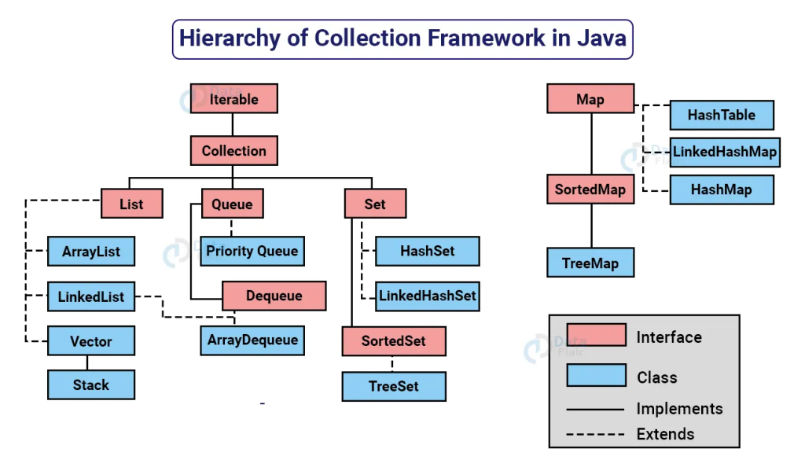

# BUỔI 7: Một số cấu trúc dữ liệu thường thấy trong Java
### 1. Cấu trúc dữ liệu là gì, sử dụng khi nào?
##### 1.11. Định nghĩa
Cấu trúc dữ liệu(Data Structure) là cách lưu trữ, tổ chức dữ liệu có thứ tự, có hệ thống để dữ liệu có thể được sử dụng một cách hiệu quả, ví dụ như:
- Tốc độ truy cập dữ liệu (tìm kiếm, thêm, xóa).

- Bộ nhớ sử dụng.

- Tính linh hoạt khi thao tác với dữ liệu.

Một số `Linear Data Structure` phổ biếnbiến:
- **Array**: Sử dụng khi muốn truy cập nhanh theo chỉ số (không linh hoạt khi thay đổi kích cỡ)
- **List**: Dễ dàng thêm/xóa phần tử, duy trì thứ tự
- **Set**: Phù hợp khi cần loại bỏ phần tử trùng lặp.
- **Map**: Tối ưu cho việc lưu trữ và truy xuất dữ liệu dưới dạng cặp key-value.

Một số `Non-Linear Data Structure`:
- **Trees**: Lưu trữ các dữ liệu có tính phân bậc.
- **Graph**: Lưu trữ dữ liệu có tính liên kết.
##### 1.2. Dưới đây là hai khái niệm nền tảng hình thành nên một cấu trúc dữ liệu:

**Interface**: Mỗi cấu trúc dữ liệu có một Interface. Interface biểu diễn một tập hợp các phép tính mà một cấu trúc dữ liệu hỗ trợ. Một Interface chỉ cung cấp danh sách các phép tính được hỗ trợ, các loại tham số mà chúng có thể chấp nhận và kiểu trả về của các phép tính này.

**Implementation** (có thể hiểu là sự triển khai): Cung cấp sự biểu diễn nội bộ của một cấu trúc dữ liệu. Implementation cũng cung cấp phần định nghĩa của giải thuật được sử dụng trong các phép tính của cấu trúc dữ liệu.

### 2. Interface Iterable, Collection -> List, Set, Queue
##### 2.1. Interface Iterable
`Interface Iterable` là một interface trong Java. Nó định nghĩa một phương thức duy nhất:
```Java
Iterator<T> iterator();
```
Với mục đích để duyệt qua các phần tử của một `Collection`

*Ví dụ: sử dụng Iterator để hiển thị nội dung của ListList*
```Java
import java.util.ArrayList;
import java.util.Iterator;
import java.util.ListIterator;

public class IteratorDemo {
   public static void main(String args[]) {
       ArrayList<String> list = new ArrayList<>();

       // them phan tu vao array list
       list.add("A");
       list.add("B");
       list.add("C");
       list.add("D");
       list.add("E");
       list.add("F");

       // su dung iterator de hien thi noi dung cua list
       System.out.println("Danh sach n: ");
       Iterator<String> itr = list.iterator();
       while (itr.hasNext()) {
           Object element = itr.next();
           System.out.println(element);
       }
       System.out.println();

       // sua cac phan tu duoc lap
       ListIterator<String> litr = list.listIterator();
       while (litr.hasNext()) {
           Object element = litr.next();
           litr.set(element + " ");
       }
       System.out.println("Noi dung da duoc sua cua list: ");
       itr = list.iterator();
       while (itr.hasNext()) {
           Object element = itr.next();
           System.out.println(element);
       }
       System.out.println();

       // hien thi cac phan tu theo thu tu nguoc lai
       System.out.println("Noi dung da duoc sua cua list theo thu tu nguoc lai: ");
       while (litr.hasPrevious()) {
           Object element = litr.previous();
           System.out.println(element);
       }
       System.out.println();

       // xoa phan tu C
       litr = list.listIterator();
       while (litr.hasNext()) {
           Object element = litr.next();
           if ("C".equals(element.toString())) {
               litr.remove();
           }
       }
       System.out.println("Noi dung da duoc sua cua list: ");
       itr = list.iterator();
       while (itr.hasNext()) {
           Object element = itr.next();
           System.out.println(element);
       }
       System.out.println();

   }
}
```
##### 2.2. Interface Collection
`Collection` là interface của Java được extends(kế thừa) từ `Iterable`. Nó cung cấp các phương thức để thao tác với tập các dữ liệu:
```Java
//Một số phương thức chính của Collectionollection
boolean add(E e);               // Thêm phần tử
boolean remove(Object o);       // Xóa phần tử
boolean contains(Object o);     // Kiểm tra sự tồn tại
int size();                     // Lấy số lượng phần tử
boolean isEmpty();              // Kiểm tra rỗng
Iterator<E> iterator();         // Trả về iterator để duyệt qua các phần tử
```
Từ các phương thức được cài đặt trong interface Collection, Java phát triển thành các nhánh cấu trúc dữ liệu chính:
- **List**: Lưu trữ các phần tử có thứ tự, cho phép trùng lặp.(ArrayList, LinkedList, Vector)

- **Set**: Không lưu trữ các phần tử trùng lặp.(HashSet, LinkedHashSet, TreeSet)

- **Queue**: Lưu trữ các phần tử theo thứ tự nhập/xuất (FIFO hoặc các biến thể).(PriorityQueue, ArrayDeque)



### 3. Một số cấu trúc dữ liệu trong Java
##### 3.1. Set
**Set** là một interface kế thừa interface Collection trong java. Set trong java là một Collection không thể chứa các phần tử trùng lặp. Set không duy trì thứ tự chèn (trừ khi sử dụng các triển khai cụ thể như LinkedHashSet).

**Các loại Set phổ biến**:
- `HashSet`:
  - Cấu trúc bảng băm.
  - Không đảm bảo thứ tự của các phần tử.
  - Hiệu suất cao khi thao tác với dữ liệu lớn.
  - Cho phép phần tử null.

- `LinkedHashSet`:
  - Kế thừa từ HashSet.
  - Duy trì thứ tự chèn của các phần tử.
  - Phù hợp khi cần truy xuất theo thứ tự thêm.

- `TreeSet`:
  - Dựa trên cấu trúc cây nhị phân cân bằng.
  - Duy trì thứ tự tự nhiên hoặc theo một `Comparator` tùy chỉnh.
  - Không cho phép phần tử null.

**Một số phương thức dùng trong set**
| Phương thức        | Mô tả                                                       |
| ------------------ | ----------------------------------------------------------- |
| add(E e)           | Thêm phần tử vào tập hợp (bỏ qua nếu phần tử đã tồn tại).   |
| remove(Object o)   | Xóa phần tử cụ thể khỏi tập hợp.                            |
| contains(Object o) | Kiểm tra xem tập hợp có chứa phần tử cụ thể không.          |
| size()             | Trả về số lượng phần tử trong tập hợp.                      |
| isEmpty()          | Kiểm tra xem tập hợp có rỗng không.                         |
| clear()            | Xóa tất cả các phần tử trong tập hợp.                       |
| iterator()         | Trả về một iterator để duyệt qua các phần tử trong tập hợp. |

Ví dụ về HashSet:
```Java
import java.util.HashSet;
import java.util.Set;

public class HashSetExample {
    public static void main(String[] args) {
        Set<String> set = new HashSet<>();

        // Thêm phần tử vào HashSet
        set.add("Java");
        set.add("Python");
        set.add("C++");
        set.add("Java"); // Bỏ qua vì "Java" đã tồn tại

        // Duyệt qua các phần tử
        for (String item : set) {
            System.out.println(item);
        }

        // Kiểm tra sự tồn tại của một phần tử
        System.out.println("Set có chứa Python không? " + set.contains("Python"));

        // Xóa phần tử
        set.remove("C++");
        System.out.println("Set sau khi xóa C++: " + set);

        // Số lượng phần tử
        System.out.println("Kích thước của Set: " + set.size());
    }
}
```
Kết quả:
```
Java
C++
Python
Set có chứa Python không? true
Set sau khi xóa C++: [Java, Python]
Kích thước của Set: 2
```
Ví dụ về TreeSet:
```Java
import java.util.TreeSet;

public class TreeSetExample {
    public static void main(String[] args) {
        TreeSet<Integer> treeSet = new TreeSet<>();

        // Thêm phần tử
        treeSet.add(5);
        treeSet.add(1);
        treeSet.add(3);
        treeSet.add(2);

        // Duyệt qua các phần tử theo thứ tự tự nhiên
        System.out.println("TreeSet theo thứ tự tự nhiên: " + treeSet);

        // Lấy phần tử đầu tiên và cuối cùng
        System.out.println("Phần tử nhỏ nhất: " + treeSet.first());
        System.out.println("Phần tử lớn nhất: " + treeSet.last());

        // Xóa phần tử
        treeSet.remove(3);
        System.out.println("TreeSet sau khi xóa phần tử 3: " + treeSet);
    }
}
```
Kết quả:
```
TreeSet theo thứ tự tự nhiên: [1, 2, 3, 5]
Phần tử nhỏ nhất: 1
Phần tử lớn nhất: 5
TreeSet sau khi xóa phần tử 3: [1, 2, 5]
```

##### 3.2. Map
**Map** là một interface trong Java kế thừa từ interface Colletion, được sử dụng để lưu trữ các cặp key-value. Mỗi khóa là duy nhất, và mỗi khóa ánh xạ với một giá trị. Map rất hữu ích nếu bạn phải tìm kiếm, cập nhật hoặc xóa các phần tử trên dựa vào các key.

**Các loại Map phổ biến**:
- `HashMap`:
  - Cấu trúc bảng băm.
  - Không đảm bảo thứ tự các phần tử.
  - Hỗ trợ các khóa và giá trị null.
  - Hiệu suất cao khi thao tác với dữ liệu lớn.

- `LinkedHashMap`:
  - Kế thừa từ HashMap.
  - Duy trì thứ tự chèn của các phần tử.
  - Hiệu quả khi cần truy xuất dữ liệu theo thứ tự thêm.

- `TreeMap`:
  - Dựa trên cấu trúc cây nhị phân cân bằng.
  - Duy trì thứ tự tự nhiên của các khóa (hoặc theo một Comparator tùy chỉnh).
  - Chậm hơn HashMap trong hầu hết các thao tác.

- `Hashtable`:
  - Giống HashMap nhưng đồng bộ hóa (thread-safe).
  - Không cho phép null làm khóa hoặc giá trị.
  - Ít được sử dụng trong các ứng dụng hiện đại.

**Một số phương thức thường dùng trong Map**:
| Phương thức                 | Mô tả                                                           |
| --------------------------- | --------------------------------------------------------------- |
| put(K key, V value)         | Thêm một cặp khóa-giá trị vào map.                              |
| get(Object key)             | Lấy giá trị tương ứng với khóa, trả về null nếu không tìm thấy. |
| containsKey(Object key)     | Kiểm tra khóa có tồn tại trong map hay không.                   |
| containsValue(Object value) | Kiểm tra giá trị có tồn tại trong map hay không.                |
| remove(Object key)          | Xóa cặp khóa-giá trị dựa vào khóa.                              |
| size()                      | Trả về số lượng cặp khóa-giá trị trong map.                     |
| keySet()                    | Trả về tập hợp các khóa trong map.                              |
| values()                    | Trả về tập hợp các giá trị trong map.                           |
| entrySet()                  | Trả về tập hợp các cặp Map.Entry (key-value) trong map.         |

Ví dụ:
```Java
import java.util.*;

public class MapExample {
    public static void main(String[] args) {
        // Tạo một HashMap
        Map<Integer, String> map = new HashMap<>();

        // Thêm cặp key-value
        map.put(1, "Java");
        map.put(2, "Python");
        map.put(3, "C++");

        // Duyệt qua các phần tử trong map
        for (Map.Entry<Integer, String> entry : map.entrySet()) {
            System.out.println("Key: " + entry.getKey() + ", Value: " + entry.getValue());
        }

        // Truy xuất giá trị dựa trên khóa
        System.out.println("Value của key 2: " + map.get(2));

        // Kiểm tra sự tồn tại của khóa và giá trị
        System.out.println("Có chứa key 3 không? " + map.containsKey(3));
        System.out.println("Có chứa value 'Java' không? " + map.containsValue("Java"));

        // Xóa một phần tử
        map.remove(1);
        System.out.println("Map sau khi xóa key 1: " + map);
    }
}
```

Kết quả:
```
Key: 1, Value: Java
Key: 2, Value: Python
Key: 3, Value: C++
Value của key 2: Python
Có chứa key 3 không? true
Có chứa value 'Java' không? true
Map sau khi xóa key 1: {2=Python, 3=C++}
```

### 4. Vì sao lại có nhiều Collection class?
1. Đáp ứng đa dạng yêu cầu:

- Dữ liệu có thể cần được lưu trữ dưới dạng danh sách, tập hợp, hàng đợi hoặc bản đồ.
- Một số bài toán yêu cầu duy trì thứ tự, trong khi số khác không cần.
2. Tối ưu hóa hiệu suất:

- Ví dụ, ArrayList nhanh hơn khi truy xuất ngẫu nhiên, nhưng LinkedList lại tốt hơn khi thao tác thêm/xóa ở đầu hoặc giữa danh sách.
3. Tính linh hoạt:

- HashSet là tập hợp không trùng lặp, nhưng không duy trì thứ tự.
- LinkedHashSet duy trì thứ tự chèn, trong khi TreeSet sắp xếp theo thứ tự tự nhiên hoặc tùy chỉnh.
4. Dễ mở rộng và bảo trì:

- Java Collections được thiết kế theo dạng interface (List, Set, Queue, Map), cho phép các triển khai cụ thể (ArrayList, HashMap, PriorityQueue, v.v.) dễ dàng mở rộng.

**Nên chọn class nào để sử dụng?**
Tùy vào yêu cầu cụ thể, bạn có thể chọn lớp phù hợp.

1. Làm việc với danh sách (List):
- Khi nào dùng ArrayList:
  - Truy xuất phần tử thường xuyên.
  - Dữ liệu không thay đổi kích thước quá nhiều.
- Khi nào dùng LinkedList:
  - Cần thêm/xóa ở đầu hoặc giữa danh sách nhiều lần.
  - Không cần truy cập ngẫu nhiên.
2. Làm việc với tập hợp (Set):
- Khi nào dùng HashSet:
  - Chỉ cần đảm bảo các phần tử là duy nhất.
  - Không quan tâm thứ tự.
- Khi nào dùng LinkedHashSet:
  - Cần duy trì thứ tự chèn.
- Khi nào dùng TreeSet:
  - Cần các phần tử được sắp xếp tự nhiên hoặc theo thứ tự tùy chỉnh.
3. Làm việc với hàng đợi (Queue):
- Khi nào dùng PriorityQueue:
  - Cần xử lý theo độ ưu tiên (ví dụ: hàng đợi ưu tiên trong thuật toán).
- Khi nào dùng LinkedList:
  - Dùng như một hàng đợi thông thường (FIFO - First In First Out).
4. Làm việc với bản đồ (Map):
- Khi nào dùng HashMap:
  - Không quan tâm thứ tự của các cặp key-value.
  - Hiệu suất tốt khi truy xuất, thêm/xóa.
- Khi nào dùng LinkedHashMap:
  - Cần duy trì thứ tự chèn.
- Khi nào dùng TreeMap:
  - Cần các key được sắp xếp theo thứ tự tự nhiên hoặc tùy chỉnh.

### 5. Comparable và Comparator
- Trong Java, có 2 cách để sắp xếp các phần tử của một cấu trúc dữ liệu, đó là sử dụng **Comparable** và **Comparator**.

##### 5.1. Comparable
- Comparable là một interface trong Java được sử dụng để xác định thứ tự tự nhiên (natural ordering) của các đối tượng.
- Cách hoạt động của Comparable là:
  1. ta sẽ implement interface Comparable vào class đối tượng cần được sắp xếp. Sau đó Override lại phương thức `compareTo()` của Comparable theo yêu cầu của bài toán.
    *"Hàm `compareTo()` sẽ trả về một số nguyên, và nó sẽ được sử dụng để so sánh 2 phần tử của cấu trúc dữ liệu đó. Nếu trả về số âm, thì phần tử đầu tiên sẽ được đặt trước phần tử thứ hai, nếu trả về số dương, thì phần tử thứ hai sẽ được đặt trước phần tử đầu tiên, nếu trả về 0, thì 2 phần tử sẽ được đặt ngang hàng với nhau."*
  2. Sử dụng hàm `sort()` của class Collections để sắp xếp các phần tử của một List chứa các đối tượng của class đã implement interface Comparable.
- Ví dụ:
```Java
import java.util.*;

class Student implements Comparable<Student> {
    private String name;
    private int age;

    public Student(String name, int age) {
        this.name = name;
        this.age = age;
    }

    public String getName() {
        return name;
    }

    public int getAge() {
        return age;
    }

    @Override
    public int compareTo(Student other) {
        // So sánh theo tên (thứ tự tự nhiên)
        return this.name.compareTo(other.name);
    }

    @Override
    public String toString() {
        return name + " - " + age;
    }
}

public class ComparableExample {
    public static void main(String[] args) {
        List<Student> students = Arrays.asList(
            new Student("An", 20),
            new Student("Binh", 22),
            new Student("Chau", 19)
        );

        Collections.sort(students);
        System.out.println("Danh sách sắp xếp theo tên:");
        for (Student s : students) {
            System.out.println(s);
        }
    }
}
```
Kết quả:
```
Danh sách sắp xếp theo tên:
An - 20
Binh - 22
Chau - 19
```

##### 5.2. Comparator
- Là một interface trong Java, cho phép định nghĩa nhiều cách so sánh khác nhau cho một lớp.
- Cách hoạt động của Comparator:
  1. Tạo một class dùng để so sánh, implement interface Comparator
  2. Override lại phương thức `compare()` theo yêu cầu của bài toán
  3. Để sử dụng so sánh, ta có thể sử dụng hàm `sort()` của class Collections để sắp xếp các phần tử của một List
- Ví dụ:
```Java
import java.util.*;
class Student {
    private String name;
    private int age;

    public Student(String name, int age) {
        this.name = name;
        this.age = age;
    }

    public String getName() {
        return name;
    }

    public int getAge() {
        return age;
    }

    @Override
    public String toString() {
        return name + " - " + age;
    }
}

// Lớp Comparator riêng để so sánh theo tuổi
class AgeComparator implements Comparator<Student> {
    @Override
    public int compare(Student s1, Student s2) {
        return Integer.compare(s1.getAge(), s2.getAge());
    }
}

public class Main {
    public static void main(String[] args) {
        List<Student> students = Arrays.asList(
            new Student("An", 20),
            new Student("Binh", 22),
            new Student("Chau", 19)
        );

        Collections.sort(students, new AgeComparator());

        System.out.println("Danh sách sắp xếp theo tuổi:");
        for (Student s : students) {
            System.out.println(s);
        }
    }
}
```

Ngoài cách triển khai Comparator bằng 1 class riêng, ta có thể triển khai bằng các cách sau:

- Lambda expressions
```java
Comparator<Student> ageComparator = (s1, s2) -> Integer.compare(s1.getAge(), s2.getAge());
Collections.sort(students, ageComparator);
```
- Anonymous class
```Java
Collections.sort(students, new Comparator<Student>() {
    @Override
    public int compare(Student s1, Student s2) {
        return Integer.compare(s1.getAge(), s2.getAge());
    }
});
```
- Sử dụng Comparator.comparing (Java 8 trở lên)
```Java
import java.util.*;

public class Main {
    public static void main(String[] args) {
        List<Student> students = Arrays.asList(
            new Student("An", 20),
            new Student("Binh", 22),
            new Student("Chau", 19)
        );

        // Dùng Comparator.comparing
        students.sort(Comparator.comparing(Student::getAge));

        System.out.println("Danh sách sắp xếp theo tuổi:");
        for (Student s : students) {
            System.out.println(s);
        }
    }
}
```
- Kết hợp nhiều tiêu chí với Comparator.comparing
```Java
students.sort(Comparator.comparing(Student::getName).thenComparing(Student::getAge));
```
- Sắp xếp ngược
```Java
students.sort(Comparator.comparing(Student::getAge).reversed());
```
##### 5.3 So sánh Comparable và Comparator
| Tiêu chí              | Comparable                            | Comparator                                                            |
| --------------------- | ------------------------------------- | --------------------------------------------------------------------- |
| Gói                   | java.lang                             | java.util                                                             |
| Thứ tự                | định nghĩa                            | Thứ tự tự nhiên (natural ordering)	Có thể định nghĩa thứ tự tùy chỉnh |
| Cách sử dụng          | Implement compareTo trong lớp         | Sử dụng một lớp riêng hoặc lambda                                     |
| Độ linh hoạt          | Ít linh hoạt, chỉ có một cách so sánh | Linh hoạt, có thể tạo nhiều cách so sánh                              |
| Ảnh hưởng đến lớp gốc | Có, phải sửa lớp gốc                  | Không ảnh hưởng đến lớp gốc                                           |