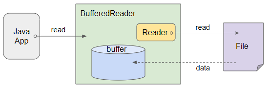
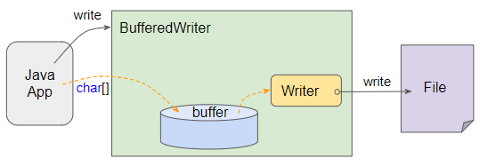

# BUỔI 8: NHẬP XUẤT FILE, EXCEPTION, UNIT TEST
## I. Xử lí file trong Java
### 1. Tổng quan về Stream?
- **Stream**(luồng) là một khái niệm đại diện cho luồng dữ liệu như bộ nhớ, collections, file, các nguồn Input/Output khác.
- Trong Java 8, có Stream là một interface trong package `java.util.stream` thực hiện các thao tác xử lí tập hợp dữ liệu như duyệt, tìm giá trị lớn(bé) nhất, sorting, filter, hay limit.
- Các phương thức trong Stream được chia thành **Intermediate Operations** (trả về Stream mới) và **Terminal Operations** (kết thúc Stream).
```Java
List<String> items = new ArrayList<String>();
items.add("table");
items.add("chopstick");
items.add("bow");
items.add("chair");

Stream<String> stream = items.stream();
```
| Nhóm         | Phương thức | Công dụng                               |
| ------------ | ----------- | --------------------------------------- |
| Intermediate | filter()    | Lọc phần tử theo điều kiện              |
|              | map()       | Biến đổi từng phần tử                   |
|              | sorted()    | Sắp xếp phần tử                         |
|              | distinct()  | Loại bỏ trùng lặp                       |
|              | limit(n)    | Giới hạn số phần tử                     |
|              | skip(n)     | Bỏ qua n phần tử đầu                    |
| Terminal     | forEach()   | Duyệt qua từng phần tử                  |
|              | collect()   |                                         | Chuyển đổi thành danh sách, tập hợp... |
|              | count()     | Đếm số phần tử                          |
|              | reduce()    | Gộp các phần tử lại thành một giá trị   |
|              | anyMatch()  | Ít nhất một phần tử thỏa mãn điều kiện  |
|              | allMatch()  | Tất cả phần tử thỏa mãn điều kiện       |
|              | noneMatch() | Không có phần tử nào thỏa mãn điều kiện |
- Một số phương thức thường dùng trong Stream:

  - filterter
```Java
List<Integer> numbers = Arrays.asList(1, 2, 3, 4, 5, 6);
List<Integer> evenNumbers = numbers.stream().filter(n -> n % 2 == 0).toList();
System.out.println(evenNumbers); // [2, 4, 6]
```
  - map (ánh xạ thành giá trị mới)
```Java
List<String> names = Arrays.asList("an", "binh", "chi");
List<String> upperCaseNames = names.stream().map(String::toUpperCase).toList();
System.out.println(upperCaseNames); // [AN, BINH, CHI]

```
  - sorted()
```Java
List<Integer> numbers = Arrays.asList(5, 2, 8, 1, 3);
List<Integer> sortedNumbers = numbers.stream().sorted().toList();
System.out.println(sortedNumbers); // [1, 2, 3, 5, 8]
```
  - Min/Max
```Java
List<Integer> list = Arrays.asList(1,2,3,4,5,6,7,8,9,10);
      Integer maxx = list.stream().max(Integer::compare).get();
      Integer minn = list.stream().min(Integer::compare).get();
      System.out.println(maxx+" "+minn);
```
  - Loại bỏ các phần tử trùng lặp.
```Java
List<Integer> numbers = Arrays.asList(1, 2, 2, 3, 3, 4);
List<Integer> distinctNumbers = numbers.stream().distinct().toList();
System.out.println(distinctNumbers); // [1, 2, 3, 4]
```
  - Duyệt qua từng phần tử và thực hiện một hành động.
```Java
Stream.of("A", "B", "C").forEach(System.out::println);
```
### 2. File trong Java
Xử lí file trong Java bao gồm cáác hoạt động:

- Nhập dữ liệu từ bàn phím
- Đọc dữ liệu từ file
- Ghi dữ liệu lên màn hình
- Ghi ra file
- Ghi ra đĩa hoặc ghi ra máy in.

Các hoạt động này đều được gọi là **stream**(luồng) trong Java.
#### 2.1. Các loại Stream trong Java
Có 2 loại Stream chính:
- ByteStream của Java dùng để đọc/ghi dữ liệu dưới dạng byte (.bin, .jpg, .mp3...). Với các lớp chính: `FileInputStream`, `FileOutputStream`
```Java
FileInputStream fis = new FileInputStream("input.dat")
FileOutputStream fos = new FileOutputStream("output.dat")
int byteData;
while (byteData = fis.read() != -1) { // Đọc từng byte
  /*
  xử lí data
  */
  fos.write(byteData); // Ghi vào file mới
}
```
- Luồng Character Stream dùng để đọc/ghi dữ liệu dạng ký tự (.txt, .csv, .json...). Các lớp chính: `FileReader`, `FileWriter`

```Java
FileReader fr = new FileReader("input.txt")
FileWriter fw = new FileWriter("output.txt")
int character;
while ((character = fr.read()) != -1) { // Đọc từng ký tự
  fw.write(character); // Ghi vào file mới
}
```
#### 2.2. BufferReader và BufferWriter
**BufferedReader** và **BufferedWriter** giúp tăng hiệu suất khi làm việc với file văn bản bằng cách đọc/ghi theo từng khối dữ liệu lớn (buffer) thay vì từng ký tự một.
- [Cách hoạt động của **BufferReader**](https://openplanning.net/13361/java-bufferedreader)

  - **BufferedReader** gói bên trong nó một đối tượng **Reader**, đối tượng này sẽ tự động đọc dữ liệu từ nguồn gốc (chẳng hạn file) và lưu trữ vào **buffer** (bộ đệm) của **BufferedReader**.
  - **BufferedReader** ghi đè (override) các phương thức thừa kế từ lớp cha của nó, chẳng hạn như `read()`, `read(char[])`,... để đảm bảo rằng chúng sẽ thao tác với dữ liệu từ buffer chứ không phải từ nguồn gốc (chẳng hạn file). Ngoài ra BufferedReader cũng cung cấp phương thức `readLine()` để đọc một dòng văn bản từ buffer
- [Cách hoạt động của **BufferWriter**](https://openplanning.net/13363/java-bufferedwriter)


  - **BufferedWriter** gói bên trong nó một đối tượng **Writer**, đối tượng này làm nhiệm vụ ghi dữ liệu vào mục tiêu (chẳng hạn file).
  - **BufferedWrite** ghi đè (override) các phương thức được thừa kế từ lớp cha của nó, chẳng hạn như `write()`, `write(char[])`,... để đảm bảo rằng dữ liệu sẽ được ghi vào **buffer** chứ không phải ghi vào mục tiêu (chẳng hạn file). Nhưng khi **buffer** đầy, tất cả dữ liệu trên **buffer** sẽ được đẩy vào **Writer** và giải phóng **buffer**. Bạn cũng có thể gọi phương thức `BufferedWriter.flush()` để chủ động đẩy tất cả dữ liệu trên **buffer** sang **Writer** và giải phóng **buffer**. Dữ liệu cũng được đẩy từ **buffer** sang **Writer** khi gọi phương thức `BufferedWriter.close()`.
  - Cái gọi là "buffer" được đề cập ở phía trên thực tế chỉ là một mảng các ký tự. Bạn có thể chỉ định kích thước của mảng này khi khởi tạo đối tượng BufferedWriter.
  - Các dữ liệu được ghi tạm vào buffer sẽ giảm thiểu việc ghi liên tục với mục tiêu (chẳng hạn file trên ổ cứng) vì vậy nâng cao hiệu xuất của chương trình.
```Java
import java.io.*;

public class BufferedReaderWriterExample {
    public static void main(String[] args) {
        try (BufferedReader br = new BufferedReader(new FileReader("input.txt"));
             BufferedWriter bw = new BufferedWriter(new FileWriter("output.txt"))) {

            String line;
            while ((line = br.readLine()) != null) {
                bw.write(line.toUpperCase()); // Chuyển thành chữ hoa
                bw.newLine(); // Xuống dòng
            }
            bw.flush();
        } catch (IOException e) {
            e.printStackTrace();
        }
    }
}
```
#### 2.3. Path
**Path**(đường dẫn) dùng để chỉ vị trí của một tệp tin hoặc thư mục trong hệ thống tệp. Có hai loại đường dẫn chính:
- Đường dẫn tuyệt đối (Absolute Path)
  - Chỉ rõ vị trí đầy đủ của một tệp tin/thư mục tính từ gốc của hệ thống tệp.
  - Không phụ thuộc vào vị trí của chương trình đang chạy.
  - Ví dụ: `C:\Documents\Java\demo.txt`
- Đường dẫn tương đối (Relative Path)
  - Xác định vị trí của tệp tin/thư mục dựa vào thư mục hiện tại của chương trình đang chạy.
  - Linh hoạt hơn, có thể chạy trên nhiều hệ thống khác nhau mà không cần sửa đổi đường dẫn.
  - Ví dụ: `Java\demo.txt`
## II. Exception
### 1. Tổng quan về Exception
- Trong Java, Exception (ngoại lệ) là một sự cố xảy ra trong quá trình thực thi chương trình, làm gián đoạn luồng bình thường của chương trình. Exception giúp lập trình viên xử lý lỗi thay vì để chương trình bị dừng đột ngột.

Ví dụ về exception khi chia cho 0:
```Java
public class ExceptionExample {
    public static void main(String[] args) {
        int a = b / 0;
        System.out.println(c);
    }
}
```
Lỗi: `Exception in thread "main" java.lang.ArithmeticException: / by zero`

### 2. Ta chia Exception thành các trường hợp:
**Checked Exception**
-. Là các exception bị kiểm tra trong quá trình biên dịch (compile-time).
-. Nếu chương trình có khả năng phát sinh checked exception, bắt buộc phải xử lý nó (dùng try-catch hoặc throws).
-. Ví dụ: `IOException`,...
**Unchecked Exception**
-. Là các exception không bị kiểm tra trong quá trình biên dịch (runtime).
-. Thường do lỗi logic của lập trình viên.
-. Ví dụ: `NullPointerException`, `ArrayIndexOutOfBoundsException`,...
**Error
-. Error là các lỗi nghiêm trọng do hệ thống, không thể khắc phục bằng try-catch.
-. Ví dụ:`OutOfMemoryError`, `StackOverflowError`

### 3. Try-catch-finally
- Để xử lí **Exception** ta có thể xử dụng câu lệnh `try - catch - finally`
```Java
/*
try {
    // Code có thể gây lỗi
} catch (Exception e) {
    // Xử lý lỗi
} finally {
    // Luôn được thực thi
}
*/
import java.io.*;

public class FinallyExample {
    public static void main(String[] args) {
        FileReader fr = null;
        try {
            fr = new FileReader("test.txt");
            System.out.println("Đọc file...");
        } catch (IOException e) {
            System.out.println("File không tồn tại!");
        } finally {
            try {
                if (fr != null) fr.close();
                System.out.println("FileReader đã đóng.");
            } catch (IOException e) {
                e.printStackTrace();
            }
        }
    }
}
```
### 4. Cây phân cấp Exception
                  Throwable  
                /         \  
          Exception      Error  
        /        \  
    Checked     Unchecked  
- Throwable: Lớp gốc của tất cả Exception và Error.
- Exception: Chứa các checked và unchecked exception.
- Error: Lỗi nghiêm trọng

### 5. `throw` và `throws`
`throw`
Dùng để ném một exception trong chương trình.
```Java
public class ThrowExample {
    public static void validateAge(int age) {
        if (age < 18) {
            throw new ArithmeticException("Tuổi phải >= 18!");
        }
        System.out.println("Đủ tuổi đăng ký!");
    }

    public static void main(String[] args) {
        validateAge(16); // Lỗi
    }
}
```
`thows`
Dùng để khai báo ngoại lệ có thể xảy ra tromh method
```Java
import java.io.*;

public class ThrowsExample {
    public static void readFile() throws IOException {
        FileReader fr = new FileReader("test.txt");
    }

    public static void main(String[] args) {
        try {
            readFile();
        } catch (IOException e) {
            System.out.println("Lỗi: File không tồn tại!");
        }
    }
}
```
### 6. Tạo Exception tùy chỉnh
Trong Java, để tạo một Exception tùy chỉnh, bạn cần kế thừa từ một lớp Exception có sẵn như Exception (Checked Exception) hoặc RuntimeException (Unchecked Exception).
##### 6.1. Checked Exception (Kế thừa Exception)
```Java
// Tạo ngoại lệ tùy chỉnh kế thừa từ Exception
class InvalidAgeException extends Exception {
    public InvalidAgeException(String message) {
        super(message);
    }
}

public class Main {
    // Phương thức có thể ném ra ngoại lệ InvalidAgeException
    public static void checkAge(int age) throws InvalidAgeException {
        if (age < 18) {
            throw new InvalidAgeException("Tuổi phải từ 18 trở lên.");
        }
        System.out.println("Tuổi hợp lệ.");
    }

    public static void main(String[] args) {
        try {
            checkAge(16);
        } catch (InvalidAgeException e) {
            System.out.println("Lỗi: " + e.getMessage());
        }
    }
}
// Vì kế thừa từ Exception, nên phương thức checkAge() phải khai báo throws InvalidAgeException, và cần try-catch để xử lý.
```
##### 6.2. Unchecked Exception (Kế thừa RuntimeException)
```Java
// Tạo ngoại lệ tùy chỉnh kế thừa từ RuntimeException
class DivideByZeroException extends RuntimeException {
    public DivideByZeroException(String message) {
        super(message);
    }
}

public class Main {
    public static int divide(int a, int b) {
        if (b == 0) {
            throw new DivideByZeroException("Không thể chia cho 0.");
        }
        return a / b;
    }

    public static void main(String[] args) {
        System.out.println(divide(10, 2)); // Hợp lệ
        System.out.println(divide(10, 0)); // Ném ngoại lệ
    }
}
//Không cần khai báo throws vì nó là Unchecked Exception, nếu gặp lỗi thì chương trình dừng ngay tại chỗ.
```