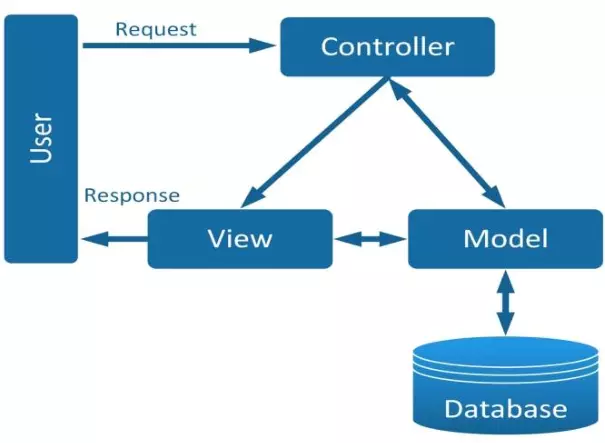

# Buổi 9: Web Design
## 1. SOLID
**S.O.L.I.D** là viết tắt của các nguyên tắc của thiết kế hướng đối tượng. Giúp cho việc viết code dễ đọc, dễ hiểu và dễ bảo trì.
- **Single responsibility priciple:** (Nguyên tắc đơn nhiệm) 
  - Mỗi class chỉ nên đảm nhận một nhiệm vụ duy nhất
- **Open/Closed principle:** (Nguyên tắc mở/đóng)
  - Không được sửa đổi một class có sẵn, nhưng có thể mở rộng bằng kế thừa
- **Liskov substitution principe:** (Nguyên tắc Liskov)
  - Đảm bảo các object của lớp con có thể thay thế bằng object của lớp cha mà không làm thay đổi bất kỳ thuộc tính, hành vi nào của chương trình.
  - Các lớp con không được thay đổi hành vi của lớp cha.
  - Các lớp con không được đưa ra các ngoại lệ mới mà nó không tồn tại trong lớp cha.
- **Interface segregation principle:** (Nguyên lí phân tách interface)
  - Thay vì dùng 1 interface lớn, ta nên tách thành nhiều interface nhỏ, với nhiều mục đích cụ thể
- **Dependency inversion principle:** (Nguyên lí phụ thuộc đảo)
  - Các module cấp cao không nên phụ thuộc vào các module cấp thấp. Cả 2 nên phụ thuộc vào abstraction.
  - Interface (abstraction) không nên phụ thuộc vào chi tiết, mà ngược lại. (Các class giao tiếp với nhau thông qua interface, không phải thông qua implementation.)
## 2. KISS, DRY, YAGNI
**KISS, DRY, YAGNI** là những nguyên tắc cần thiết cho một software developer có thể viết code hiệu quả và dễ đọc. Tong đó:
- **DRY: Dont Repeat Yourself:** Đó là một nguyên tắc nhấn mạnh tầm quan trọng của việc viết mã có thể sử dụng lại để tránh trùng lặp
- **KISS: Keep It Simple, Smart:** Là một nguyên tắc nhấn mạnh tầm quan trọng của việc giữ cho mã của bạn đơn giản và dễ hiểu
- **YAGNI: You Ain't Gonna Need It:** Đó là một nguyên tắc nhấn mạnh tầm quan trọng của việc không thêm chức năng không cần thiết vào mã của bạn

## 3. Mô hình MVC
### 3.1 Mô hình MVC là gì?
**MVC** là viết tắt của cụm từ **"Model-View-Controller"** là mô hình thiết kế được sử dụng trong kỹ thuật phần mềm, phát triển web.
**MVC** chia thành ba phần được kết nối với nhau và mỗi thành phần đều có một nhiệm vụ riêng của nó và độc lập với các thành phần khác.

### 3.2 Các thành phần trong MVC
##### a) Model
- Có nhiệm vụ thao tác với Database
- Nó chứa tất cả các hàm, các phương thức truy vấn trực tiếp với dữ liệu
- Controller sẽ thông qua các hàm, phương thức đó để lấy dữ liệu rồi gửi qua Viewq

##### b) View
- Là giao diện người dùng (User Interface)
- Chứa các thành phần tương tác với người dùng như menu, button, image, text,...
- Nơi nhận dữ liệu từ Controller và hiển thị

##### c) Controller
- Là thành phần trung gian giữa Model và View
- Đảm nhận vai trò tiếp nhận yêu cầu từ người dùng, thông qua Model để lấy dữ liệu sau đó thông qua View để hiển thị cho người dùng

### 3.3 Luồng xử lý trong MVC



### 3.4 Tại sao nên sử dụng mô hình MVC
**1. Sự độc lập và phát triển song song:** Vì mỗi thành phần trong MVC có nhiệm vụ riêng và độc lập với nhau, nên mỗi developer có thể đảm nhiệm một thành phần và không ảnh hưởng đến nhau khiến quá trình phát triển diễn ra nhanh chóng, dễ dàng
**2. Hỗ trợ bất đồng bộ:** Kỹ thuật bất đồng bộ khiến các ứng dụng được load nhanh hơn đơn giản vì tiến hành chạy nhiều câu lệnh cùng lúc Xem thêm
**3. MVC thân thiện với SEO:** Nền tảng MVC hỗ trợ phát triển các trang web thân thiện với SEO. Bằng nền tảng này, bạn có thể dễ dàng phát triển các URL thân thiện với SEO để tạo ra nhiều lượt truy cập hơn.

## 4. Các thành phần chính trong lập trình giao diện
##### 1. Thành phần cơ bản (Widgets/Components)
Đây là các yếu tố hiển thị trên màn hình của người dùng, giúp người dùng tương tác với chương trình:

- **Nút bấm (Button):** Cho phép người dùng nhấn để thực hiện một hành động.
```Java
JButton btn = new JButton("Nhấn vào đây");
btn.addActionListener(e -> System.out.println("Đã nhấn nút"));
```
- **Nhãn (Label):** Hiển thị văn bản hoặc hình ảnh tĩnh.
```Java
JLabel label = new JLabel("Đây là một nhãn kiểu text");
```
- **Ô nhập (TextField, TextArea):** Cho phép người dùng nhập dữ liệu.
```Java
JTextField textField = new JTextField(20); //Nhập 1 dòng
JTextArea textArea = new JTextArea(5, 20);  //Nhập nhiều dòng
```
- **Danh sách (List, ComboBox):** Hiển thị danh sách các lựa chọn.
```Java
JComboBox<String> comboBox = new JComboBox<>(new String[]{"Java", "C++", "Python"});
//JList: Hiển thị danh sách tùy chọn có thể chọn nhiều mục.
//JComboBox: Chọn một trong nhiều tùy chọn.
```
- **Bảng (Table):** Hiển thị dữ liệu theo dạng hàng và cột.

Biểu diễn bảng:
| ID  | Tên      |
| --- | -------- |
| 1   | Jack     |
| 2   | Thien An |
```Java
String[][] data = {{"1", "Jack"}, {"2", "An"}};
String[] columns = {"ID", "Thien An"};
JTable table = new JTable(data, columns);
```
- **Thanh trượt (Slider, Scrollbar):** Điều chỉnh giá trị bằng cách kéo thanh trượt.
```Java
JSlider slider = new JSlider(0, 100, 50);
// JSlider: Điều chỉnh giá trị bằng cách kéo thanh trượt.
// JScrollPane: Cho phép cuộn nội dung.
```
##### 2. Container (Container/Panels/Layouts)
Là thành phần chứa các thành phần giao diện khác và sắp xếp chúng theo bố cục cụ thể.

- **Panel (JPanel trong Java Swing):** Chứa các thành phần giao diện, giúp quản lý nhóm các thành phần liên quan.
```Java
JPanel panel = new JPanel();
panel.add(new JLabel("Thoát ứng dụng"));
panel.add(new JButton("X"));
```
- **Frame (JFrame, Window):** Cửa sổ chính chứa toàn bộ giao diện ứng dụng.
- **Layout Manager:** Điều chỉnh cách sắp xếp các thành phần trên giao diện (FlowLayout, BorderLayout, GridLayout...).
##### 3. Xử lý sự kiện (Event Handling)
Khi người dùng thực hiện một hành động, sự kiện sẽ được kích hoạt và xử lý.

- **Listener (Event Listener):** Lắng nghe sự kiện từ các thành phần giao diện.
- **Event Object:** Chứa thông tin về sự kiện xảy ra.
- **Event Handler:** Phương thức xử lý sự kiện khi nó được kích hoạt.
##### 4. Hệ thống đồ họa (Rendering & Drawing)
Các giao diện có thể yêu cầu vẽ đồ họa hoặc tùy chỉnh giao diện:

- **Graphics (Canvas, PaintComponent):** Cho phép vẽ hình, thay đổi màu sắc, hiển thị hình ảnh.
- **Custom UI Components:** Tạo các thành phần giao diện tùy chỉnh thay vì sử dụng sẵn.
##### 5. Luồng và cập nhật giao diện (Threading & UI Updates)
- **Main UI Thread:** Giao diện chạy trên một luồng chính, nếu thực hiện tác vụ nặng có thể làm đơ giao diện.
- **Worker Thread (SwingWorker, AsyncTask):** Xử lý các tác vụ nền mà không ảnh hưởng đến giao diện chính.
##### 6. Quản lý dữ liệu và trạng thái (State Management)
- **Model-View-Controller (MVC):** Kiến trúc phổ biến giúp tách biệt logic xử lý và giao diện.
- **Binding dữ liệu:** Liên kết giữa dữ liệu và giao diện để cập nhật tự động.